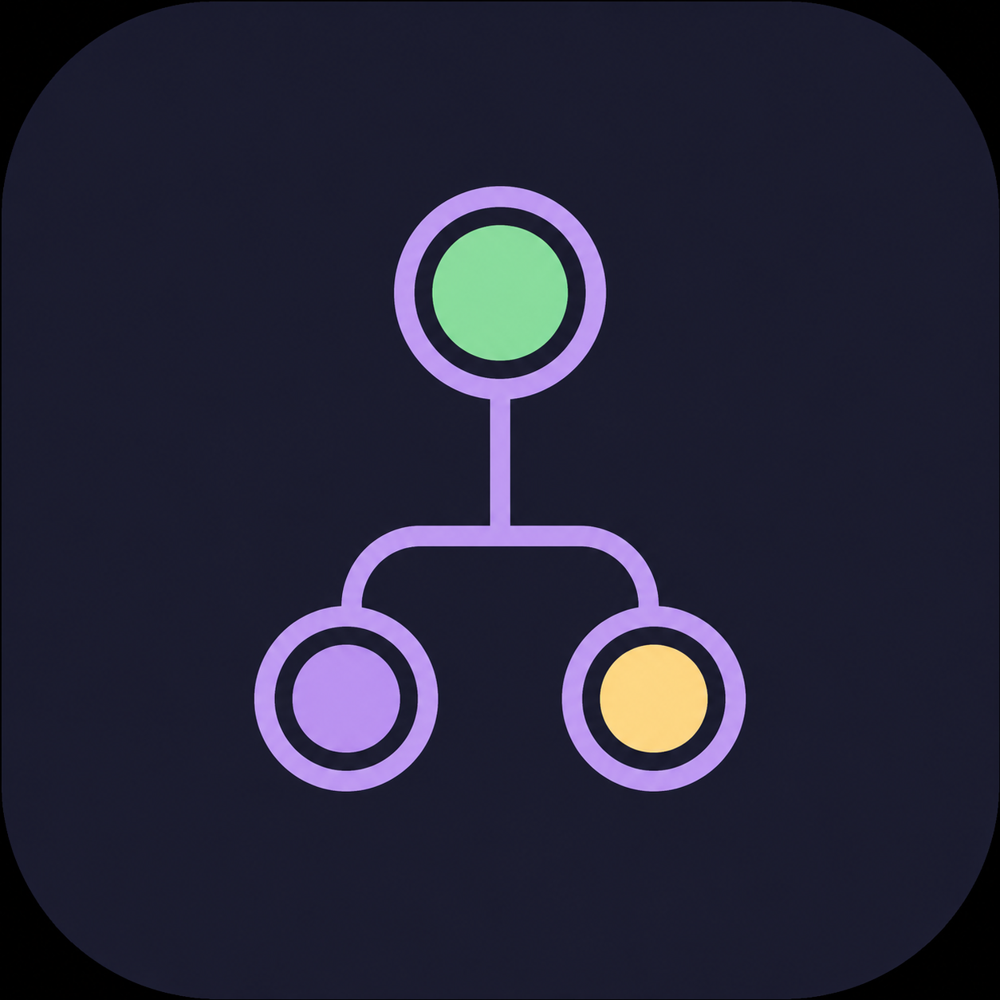
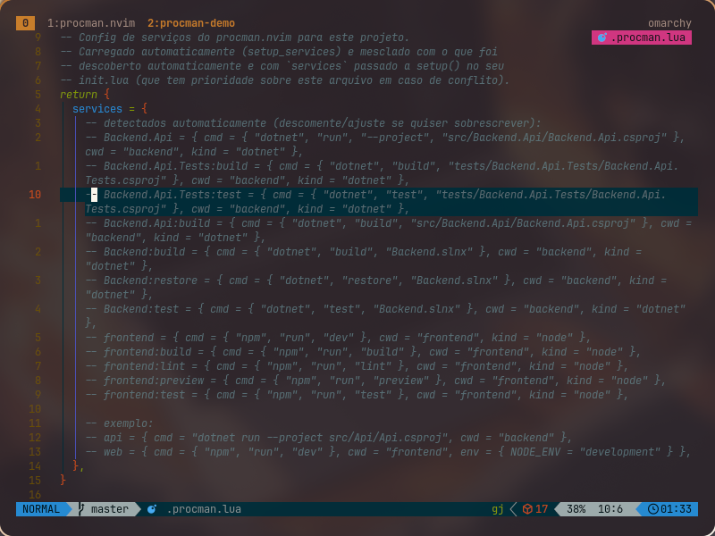
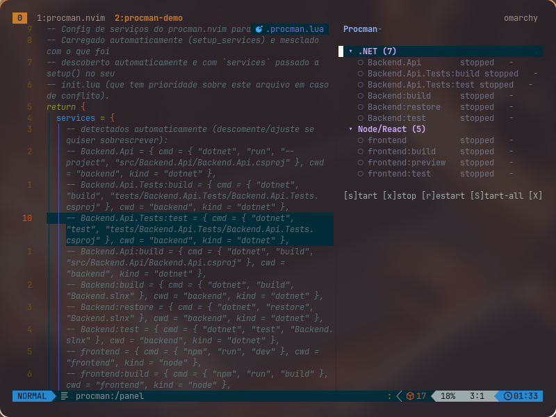

<p align="center">
  
</p>

# procman.nvim

Process/service manager for Neovim, written in Lua. Built for workspaces
with multiple services (e.g. `backend` + `frontend` + `worker`).

<video src="assets/screenrecording-2026-08-19_01-31-38.mp4" controls muted title="procman.nvim demo"></video>

<table>
  <tr>
    <td align="center" width="50%">
      <br>
      <sub><code>.procman.lua</code> pre-filled with what auto-discovery found</sub>
    </td>
    <td align="center" width="50%">
      <br>
      <sub>Panel grouped by ecosystem (.NET, Node/React, ...), with shortcuts in the footer</sub>
    </td>
  </tr>
</table>

## Features

- Auto-discovers common projects: `package.json`, `Cargo.toml`, `go.mod`,
  and .NET (`*.sln`, `*.slnx`, standalone `*.csproj`).
- .NET provider: reads `.sln`/`.slnx` and automatically generates
  `run`/`build` per project (`test`/`build` if it's a test project), plus
  `build`/`test`/`restore` at the solution level.
- Node provider: generates one service per `package.json` script (`dev`/
  `start` becomes the "primary" service, without a suffix; the rest --
  `build`, `lint`, `test`, ... -- get a `:script` suffix), not just
  `dev`/`start`.
- Provider architecture (`lua/procman/providers/`) for adding support for
  other languages/tools without touching the core.
- Start, stop, and restart one or multiple processes.
- Side panel showing the state of each process, grouped by `kind`
  (.NET/Node/Rust/Go/Custom) in collapsible sections: `running`, `stopped`,
  `failed`, `starting`.
- `:ProcManAdd`: creates a custom command via prompt (name, command, cwd,
  kind) and writes it straight into the project's `.procman.lua`.
- Memory usage (RSS, summing the process + its children) for each service,
  updated periodically.
- Logs (stdout/stderr) for each service in a floating window.
- 100% Lua configuration, with manual services merged with discovered ones.

Requires Neovim >= 0.10 (uses `vim.system` to read memory via `ps`). Works
on Linux and macOS. `ps -eo pid,ppid,rss` must be available on `$PATH` (not
tested on Windows).

## Installation

### lazy.nvim

Minimal install, no options (uses all the defaults -- auto-discovery is
already on):

```lua
return {
  "your-username/procman.nvim",
  opts = {},
}
```

With options: any key accepted by `setup()` (see [Configuration](#configuration))
can go straight into `opts` -- lazy.nvim calls `require("procman").setup(opts)`
for you, no need for `config = function() ... end`:

```lua
return {
  "your-username/procman.nvim",
  opts = {
    auto_discover = true,
    services = {
      api = { cmd = "npm run dev", cwd = "backend" },
      web = { cmd = { "npm", "start" }, cwd = "frontend" },
      worker = { cmd = "go run .", cwd = "worker", autostart = true },
    },
  },
}
```

Only want to load the plugin when a specific command runs? `opts` works
normally alongside `cmd`/`keys`/`ft` etc., like any other lazy.nvim spec:

```lua
return {
  "your-username/procman.nvim",
  cmd = { "ProcManOpen", "ProcManToggle" },
  keys = { { "<leader>pp", "<cmd>ProcManToggle<cr>", desc = "Procman" } },
  opts = {},
}
```

### packer.nvim

```lua
use({
  "your-username/procman.nvim",
  config = function()
    require("procman").setup({})
  end,
})
```

With options:

```lua
use({
  "your-username/procman.nvim",
  config = function()
    require("procman").setup({
      auto_discover = true,
      services = {
        api = { cmd = "npm run dev", cwd = "backend" },
        web = { cmd = { "npm", "start" }, cwd = "frontend" },
        worker = { cmd = "go run .", cwd = "worker", autostart = true },
      },
    })
  end,
})
```

## Configuration

All options (with their defaults) live in `lua/procman/config.lua`:

```lua
require("procman").setup({
  root = nil,              -- default: Neovim's cwd
  auto_discover = true,    -- looks for package.json/*.csproj/Cargo.toml/go.mod
  discover_depth = 3,
  discover_ignore = { "node_modules", ".git", "bin", "obj", "target", "dist", "build", ".venv" },

  services = {
    -- merges with (and overrides) what was auto-discovered
    api = {
      cmd = "npm run dev",   -- string (via shell) or argv list
      cwd = "backend",       -- relative to `root`, or an absolute path
      env = { NODE_ENV = "development" },
      autostart = false,     -- start alongside Neovim
    },
  },

  -- services per project, indexed by root path (compared against `root`
  -- after expanding "~" and normalizing). Lives in your Neovim config
  -- instead of a file inside each repository -- like dadbod-ui's `g:dbs`.
  projects = {
    ["~/Workspace/rca"] = {
      services = {
        web = { cmd = { "npm", "run", "dev" }, cwd = "apps/web" },
        api = { cmd = { "dotnet", "run", "--project", "src/Api" }, cwd = "apps/api" },
      },
    },
  },

  poll_interval = 2000,   -- ms between memory/state updates
  log_max_lines = 5000,

  panel = {
    position = "right",  -- "right" | "left" | "top" | "bottom"
    width = 42,
    height = 12,
    icons = { running = "●", stopped = "○", failed = "✗", starting = "◐" },
  },

  log_window = {
    width = 0.8,   -- fraction of screen width
    height = 0.7,
    border = "rounded",
  },

  panel_keymaps = {
    start = "s", stop = "x", restart = "r",
    start_all = "S", stop_all = "X",
    logs = "<CR>", close = "q", refresh = "R",
    toggle_group = "za", -- collapses/expands the group (kind) under the cursor
    add = "a",            -- :ProcManAdd
    hide = "H",            -- hides/reveals the service under the cursor
    show_hidden = "E",     -- toggles the visibility of hidden services
  },

  log_keymaps = {
    close = "q", stop = "x", restart = "r", scroll_end = "G",
  },
})
```

## Commands

| Command                    | Description                                    |
|-----------------------------|-------------------------------------------------|
| `:ProcManOpen`               | Open the process panel                          |
| `:ProcManToggle`             | Toggle (open/close) the panel                   |
| `:ProcManClose`              | Close the panel                                 |
| `:ProcManStart <name>`       | Start a service                                 |
| `:ProcManStop <name>`        | Stop a service                                  |
| `:ProcManRestart <name>`     | Restart a service                               |
| `:ProcManStartAll`           | Start all services                              |
| `:ProcManStopAll`            | Stop all services                               |
| `:ProcManLogs <name>`        | Open a service's logs in a floating window      |
| `:ProcManEdit`               | Create/open the project's `.procman.lua` and reload on save |
| `:ProcManAdd`                | Create a custom command via prompt and add it to `.procman.lua` |
| `:ProcManReload`             | Reload discovery + `.procman.lua` + `services` from setup() |

Every command that takes `<name>` autocompletes the configured services.

## Per-project config (`.procman.lua`)

Besides declaring `services` in `setup()` (global, in your `init.lua`), you
can have **per-project** config: run `:ProcManEdit` inside the workspace. If
`.procman.lua` doesn't exist yet at the root, it's created with a template
pre-filled with whatever auto-discovery already found (you can also
manually declare things it did *not* detect there, like a `.csproj` outside
of `discover_depth`).

```lua
-- .procman.lua at the monorepo root
return {
  services = {
    api = { cmd = "dotnet run --project src/Api/Api.csproj", cwd = "backend" },
    web = { cmd = { "npm", "run", "dev" }, cwd = "frontend" },
  },
}
```

Merge priority (later overrides earlier): auto-discovery → the project's
`.procman.lua` → `services` passed to `setup()` in your `init.lua`. When you
save `.procman.lua` (via `:ProcManEdit`), services reload immediately -- no
need to restart Neovim. It's recommended to add `.procman.lua` to
`.gitignore` if the commands/paths are specific to your machine.

## Panel

Services appear grouped by `kind` (`.NET`, `Node/React`, `Rust`, `Go`,
`Custom`), in collapsible sections -- useful for monorepos, since providers
like `dotnet` and `node` now generate several tasks per project (e.g.
`run`, `build`, `test`, `lint`, ...) instead of just one.

Inside the panel (`:ProcManOpen`), with the cursor over a service line:

- `s` starts the service under the cursor
- `x` stops the service under the cursor
- `r` restarts the service under the cursor
- `S` starts all services
- `X` stops all services
- `<CR>` opens the logs of the service under the cursor; over a group's
  header line, it collapses/expands that group
- `R` forces an immediate memory/state refresh
- `za` collapses/expands the group under the cursor (works both on the
  group's header and on a service line inside it)
- `a` runs `:ProcManAdd` (custom command via prompt)
- `H` hides the service under the cursor (it disappears from the list); a
  group left with only hidden services disappears entirely
- `E` shows the hidden services (marked "(hidden)" and dimmed) -- with them
  visible, `H` again on one of them reveals the service
- `q` closes the panel

## Log window

Inside the floating log window (`:ProcManLogs <name>`):

- `x` stops the process
- `r` restarts the process
- `G` jumps to the end of the log
- `q` closes the window

## Lua API

```lua
local procman = require("procman")

procman.open_panel()
procman.toggle_panel()
procman.open_logs("api")
procman.start("api")
procman.stop("api")
procman.restart("api")
procman.start_all()
procman.stop_all()
procman.list()      -- list of service names
procman.get("api")  -- table with status, pid, rss_kb, cmd, cwd, ...
procman.reload()    -- reloads discovery + .procman.lua + services
```

Suggested global keymaps:

```lua
vim.keymap.set("n", "<leader>pp", require("procman").toggle_panel)
vim.keymap.set("n", "<leader>pl", function()
  vim.ui.select(require("procman").list(), { prompt = "Logs for:" }, function(name)
    if name then require("procman").open_logs(name) end
  end)
end)
```

## How auto-discovery works

`discover` walks `root` up to `discover_depth` levels, skipping the folders
in `discover_ignore`. In each directory, it asks every registered
*provider* (`lua/procman/providers/`) whether it recognizes anything there;
if it does, it registers one or more services. The walk keeps descending
into subfolders normally even after a provider matches -- important in
monorepos where, e.g., the `.sln` sits at the root alongside sibling
folders of other ecosystems (`frontend/`, `worker/`, ...); only the
provider that already matched gets suppressed on the branch below it, so it
doesn't re-detect as a duplicate service a file that's already part of the
project it found (e.g. a `.csproj` already referenced by the `.sln`):

| Marker             | Services generated                                                      |
|---------------------|---------------------------------------------------------------------------|
| `package.json`      | `<name>`: the `dev` script (if present) or `start`, as the primary service; every other script becomes `<name>:script` |
| `Cargo.toml`        | `<name>`: `cargo run`                                                    |
| `go.mod`            | `<name>`: `go run .`                                                     |
| `*.sln` / `*.slnx`  | per referenced project: `<Project>` (`dotnet run`) or `<Project>:test` (if a test project) + `<Project>:build`; and at the solution level: `<Solution>:build`, `<Solution>:test`, `<Solution>:restore` |
| standalone `*.csproj` | `<Project>` (`dotnet run`) or `<Project>:test` + `<Project>:build`     |

A .NET project is considered a "test project" if it references
`Microsoft.NET.Test.Sdk`, sets `<IsTestProject>true</IsTestProject>`, or
follows the `*Tests.csproj`/`*Test.csproj` naming convention -- in that
case it gets `test` instead of `run`. Project paths come straight from the
`.sln`/`.slnx`, so they aren't limited by `discover_depth`.

Services defined manually in `services` take priority and override any
discovered service with the same name.

### Adding a provider

Each provider is a module in `lua/procman/providers/<name>.lua` that
implements two functions:

```lua
---@class ProcManProvider
---@field detect fun(dir: string, entries: ProcManDirEntry[]): boolean
---@field discover fun(dir: string, entries: ProcManDirEntry[], root: string): table<string, ProcManServiceConfig>
```

`detect` says whether that directory is the root of a project recognized by
this provider; `discover` (only called if `detect` returns `true`) returns
the services found, in the same format as `services` in `setup()`. Then
just register the module in `lua/procman/providers/init.lua` (`M.all`). See
`providers/dotnet.lua` as a reference for a more complete provider (parses
a solution file, multiple tasks per project).

## Memory usage

Every `poll_interval` ms (only while some service is running), the plugin
runs `ps -eo pid,ppid,rss` once, builds the system's process tree, and sums
the RSS of each service's root pid with all of its descendants --
important because commands like `npm run dev` typically spawn a real child
process, and the root process's RSS alone would be misleading.
